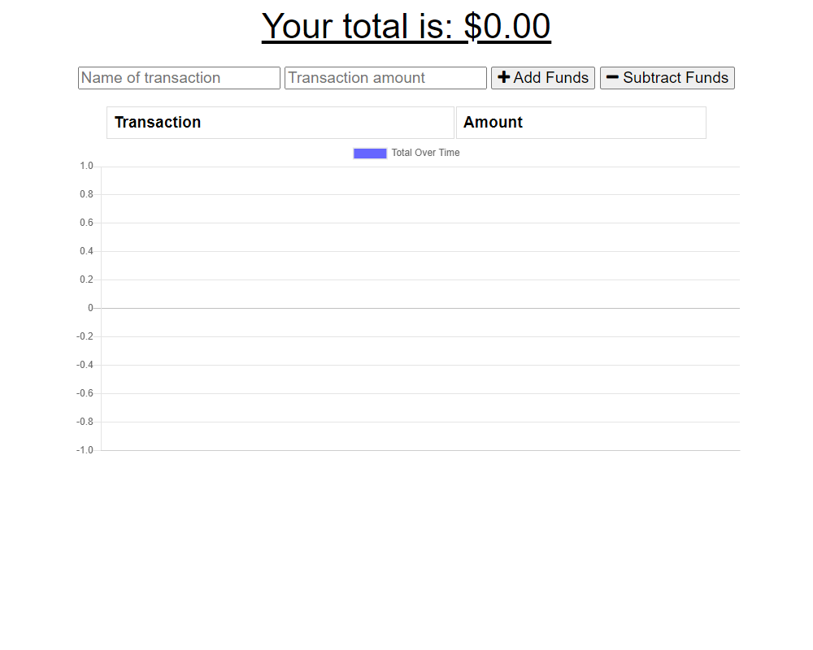
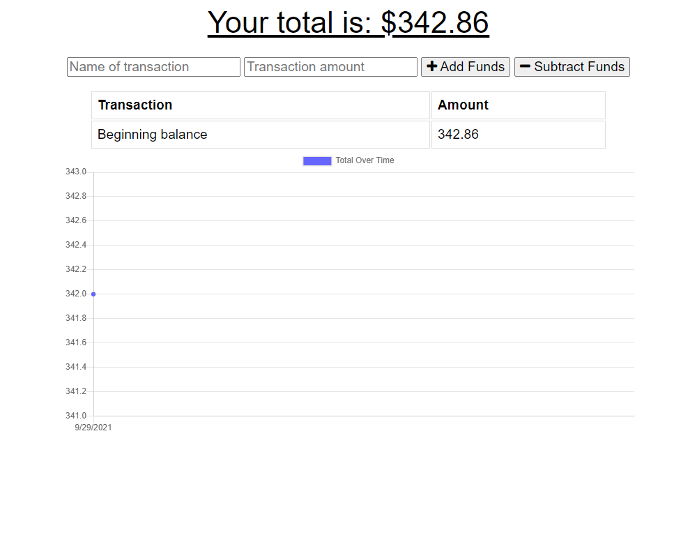
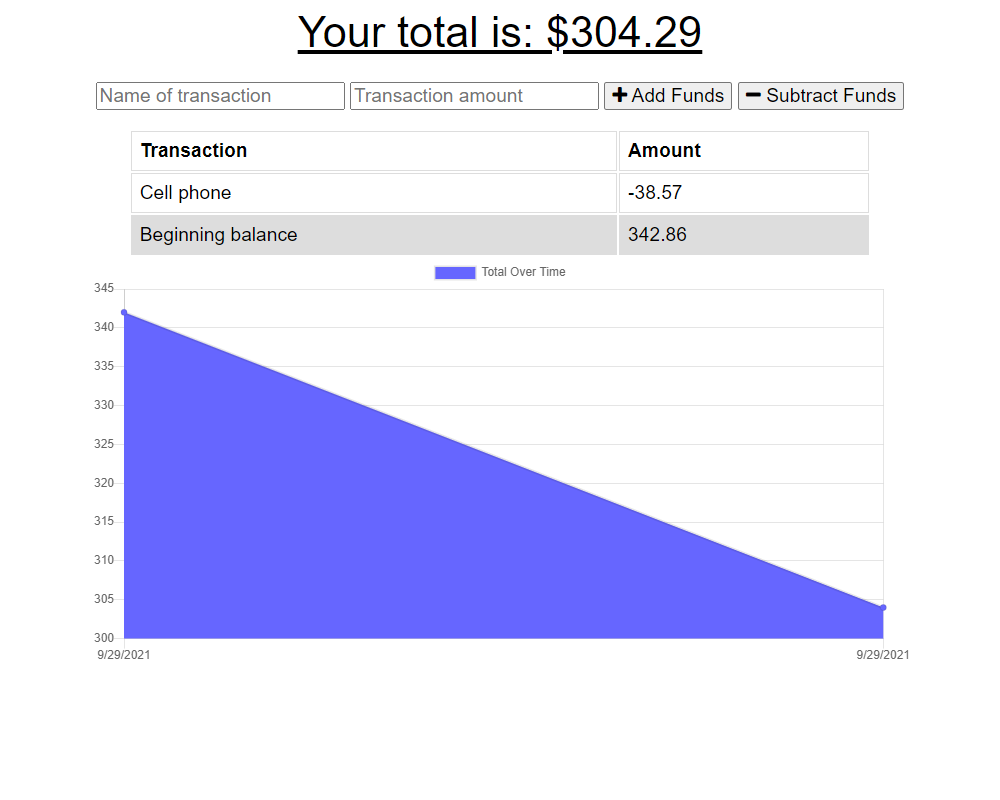
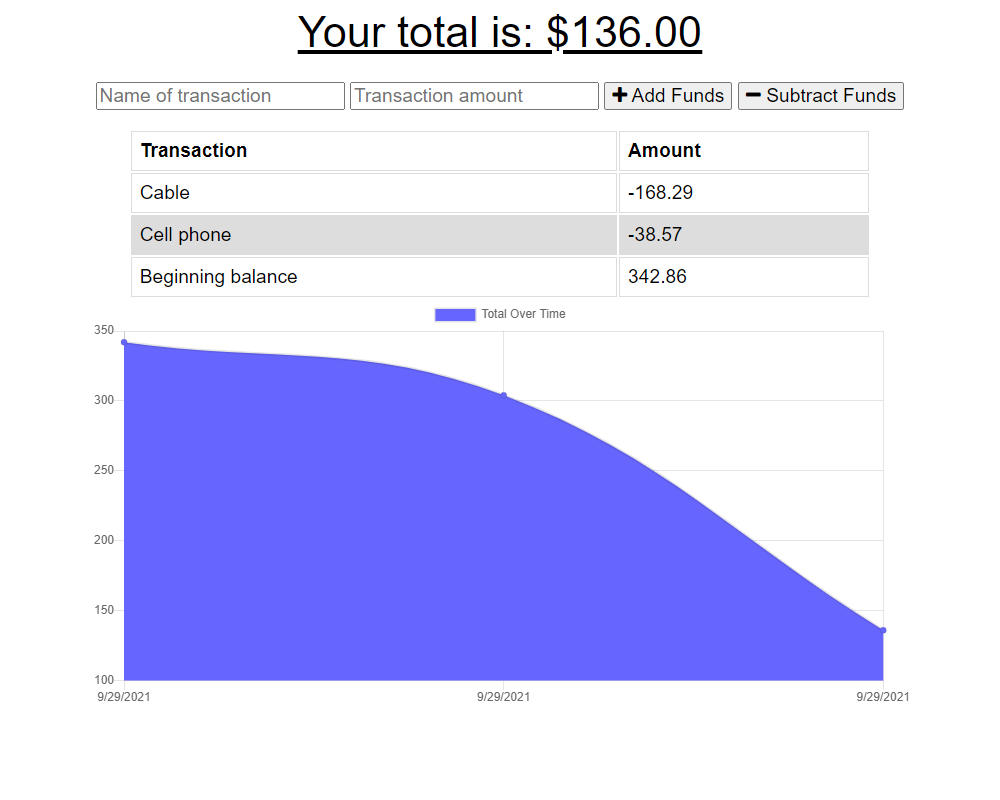
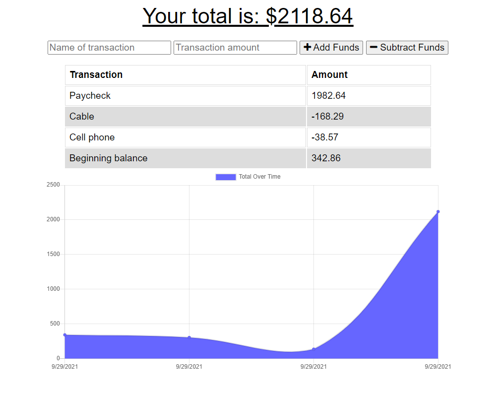
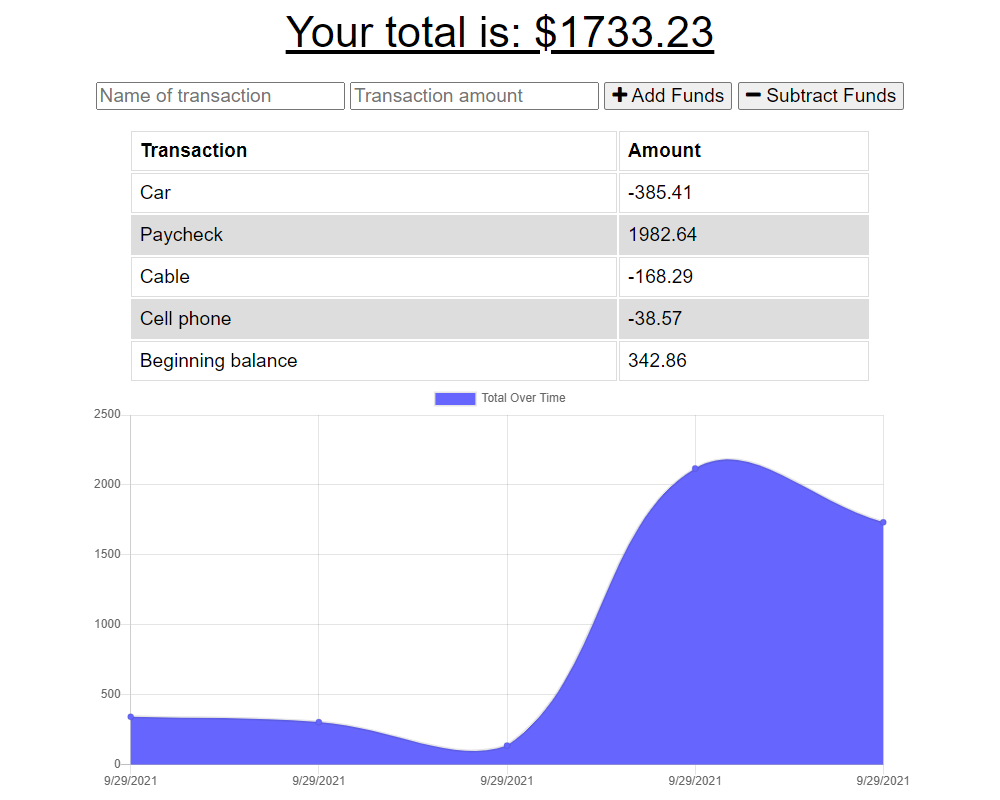

# Online/Offline Budget Tracker

## Description
This app is a budget tracker that allows you to keep track of deposits and expenses, even if you don't have an internet connection.

If you're online, then all transaction are immediately entered into the database. If you have no internet connection, the transactions are saved in IndexedDB and are posted to the database when an internet connection is available.

The balance is shown at the top of the page, with a list of all transactions in the middle, and a graph of the running balance is at the bottom.

This app uses ```HTML```, ```CSS```, ```JavaScript```, ```Node.js```, ```Express.js```, ```MongoDB```, ```Mongoose```, and ```IndexedDB```.

## Screenshots
Start page            | First entry
:-------------------:|:-------------------:
 | 
Second entry         | Third entry
 | 
Fourth entry         | Fifth entry
 | 

## Questions
If you have questions about this repo, open an issue or contact me directly at todd@weloveeats.com. You can find more of my work at [tharveyster](https://github.com/tharveyster).

## License
ISC

Copyright 2021 Todd Harvey

Permission to use, copy, modify, and/or distribute this software for any purpose with or without fee is hereby granted, provided that the above copyright notice and this permission notice appear in all copies.

THE SOFTWARE IS PROVIDED "AS IS" AND THE AUTHOR DISCLAIMS ALL WARRANTIES WITH REGARD TO THIS SOFTWARE INCLUDING ALL IMPLIED WARRANTIES OF MERCHANTABILITY AND FITNESS. IN NO EVENT SHALL THE AUTHOR BE LIABLE FOR ANY SPECIAL, DIRECT, INDIRECT, OR CONSEQUENTIAL DAMAGES OR ANY DAMAGES WHATSOEVER RESULTING FROM LOSS OF USE, DATA OR PROFITS, WHETHER IN AN ACTION OF CONTRACT, NEGLIGENCE OR OTHER TORTIOUS ACTION, ARISING OUT OF OR IN CONNECTION WITH THE USE OR PERFORMANCE OF THIS SOFTWARE.
